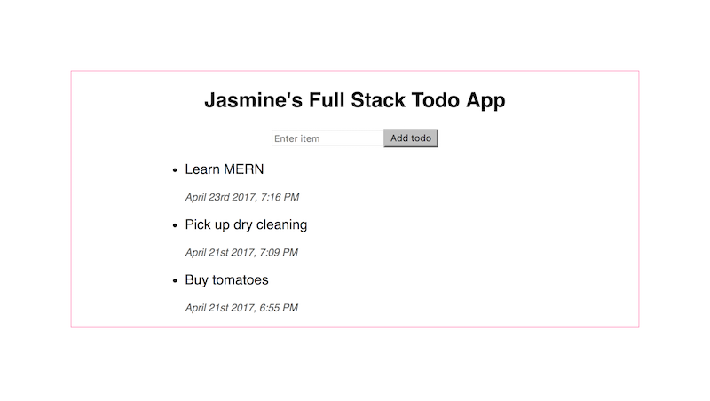

# Feel the MERN 🔥

MongoDB + Express + React + Node.js

## Getting Started

### What to expect

In this session, you will learn to build a simple CRUD todo app using the MERN stack.



* The final app will allow you to add todo items and view previously added items.

* **BONUS:** Add update and delete functionality to make it fully CRUD!


### Let's begin! ... Where do I start?

For the purposes of this exercise, you will be using [Create React App](https://github.com/facebookincubator/create-react-app), as it is currently the recommended method on the official documentation. [<sup>[1]</sup>](#user-content-1) However, please take the time to briefly understand what this setup is providing your application behind the scenes. [<sup>[2]</sup>](#user-content-2)

You will name your application `mern-todo`, or another name of your choice, when you first run `create-react-app`.

```shell
create-react-app mern-todo && cd mern-todo/
```

### The Four Stages of MERN

This exercise will broken into four stages, to ease into the application building process.

* [Stage 1: *Frontend*](#stage-1-frontend)
* Stage 2: *Backend*
* Stage 3: *Database*
* Stage 4: *CRUD*

### Stage 1: Frontend

> In this stage, you will build the React components needed to display new todo items and add new ones.

Running `create-react-app` should have given you the default React project setup. You can now remove any unnecessary files and begin to build the components you'll need for `mern-todo`.

If you're unsure what components to create, think about what a todo app is. You might use such a tool to write down items and save it for reference at a later time. So you might like to have one component that contains a form, and another that shows a list of items. Refer back to the visual at the beginning of this guide, or come up with your own.

For now, you will store your todo items as a JSON object in a file such as `data.js` in the project root folder.

```javascript
// data.js

const data = [
  { id: 1, item: "Buy tomatoes" },
  { id: 2, item: "Pick up dry cleaning" },
  { id: 3, item: "Learn MERN" }
]

module.exports = data;
```

At this point, your folder structure should resemble the following:

```
. mern-todo/
├── nodemodules/
├── public/
│   ├── index.html
├── src/
│   ├── components/
│   │   ├── TodoForm.js
│   │   └── TodoList.is
│   ├── index.js
│   ├── style.css
│   ├── TodoApp.js
├── .gitignore
├── data.js
├── package.json
└── README.md
```

Use the provided `index.html` and `style.css` in the activity, unless you wish to create your own.

#### index.js

* Render the component `TodoApp`, which will be declared in another file `TodoApp.js`.

```javascript
// index.js
import React from 'react';
import ReactDOM from 'react-dom';
import TodoApp from './TodoApp';

ReactDOM.render(
  <TodoApp />,
  document.getElementById('root')
);
```

#### TodoApp.js

* `TodoApp` will contain two children components:  `TodoForm` and `TodoList`.

* For now, you will get your data from the `data.js` file you created earlier.

* `TodoApp` will have an initial state called `data` that is an empty array.

* `TodoApp` will pass the data as a prop to the child `TodoList`.

```javascript
// TodoApp.js
import React, { Component } from 'react';
// get your children components
import TodoForm from './components/TodoForm';
import TodoList from './components/TodoList';
// get your data
import DATA from '../data';

class TodoApp extends Component {
  constructor(props) {
    super(props);
    this.state = { data: [] };
  }
  render() {
    <div className="main">
      <h2>My Full Stack Todo App</h2>
      <TodoForm />
      <TodoList data={DATA} />
    </div>
  }
}

export default TodoApp;
```

...

## Notes

* <a name="1"><sup>1</sup></a> [React Docs - Installation - Creating a New Application](https://facebook.github.io/react/docs/installation.html)
* <a name="2"><sup>2</sup></a> [Create React App - Why Use This?](https://github.com/facebookincubator/create-react-app#why-use-this)

- - -

### Copyright

Coding Boot Camp © 2017. All Rights Reserved.
